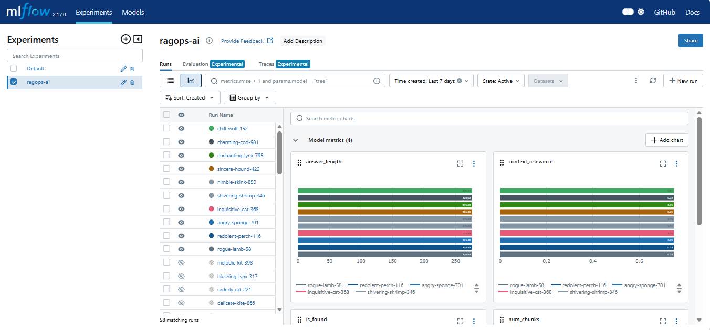

## 🚀 RAGOps-AI: Production-Ready RAG System with MLOps 

---
### 📌 Project Overview

RAGOps-AI is an end-to-end Retrieval-Augmented Generation (RAG) system built using modern AI engineering and MLOps practices.

The project enables users to ask questions about a resume through a web interface while leveraging:

Semantic search with vector databases
LLM-powered response generation
Experiment tracking
Containerized deployment
CI/CD automation
Monitoring and observability
Load testing and system validation

This project was built following a structured 30-Day RAGOps roadmap to simulate real-world AI production workflows.

---
---
## 🚀 Live Demo
👉 **[Try the Live link here](https://ragops-streamlit-ui.onrender.com)**


> Built with Streamlit and deployed on Render

---
---
### 🎯 Problem Statement
Traditional resume search systems rely on keyword matching and fail to understand context.

This project solves that problem by:

* Converting resume content into vector embeddings
* Storing embeddings in ChromaDB
* Retrieving relevant context using semantic search
* Generating grounded answers using LLMs
* Tracking experiments and system performance

---
---
### 🏗️ Architecture Diagram


---
---

### 🛠️ Tech Stack

**AI / LLM**
* LangChain
* Hugging Face Inference API
* DeepSeek V4
* Sentence Transformers

**Backend** 
* FastAPI
* Pydantic

**Vector Database**
* ChromaDB

**MLOps**
* MLflow

**Deployment**
* Docker
* Docker Compose
* Render

**CI/CD**
* GitHub Actions

**Testing**
* Pytest
* Locust

---

---
### 📂 Project Structure


```
ragops-ai/
│
├── .github/
│   └── workflows/
│       ├── ci.yml
│       └── cd.yml
│
├── app/
│   ├── __init__.py
│   ├── main.py                 # FastAPI application
│   ├── rag_chain.py            # RAG pipeline
│   └── streamlit_ui.py         # Streamlit frontend
│
├── tests/
│   ├── __init__.py
│   ├── test_main.py
│   ├── test_rag_chain.py
│   ├── load_test.py            # Stress testing
│   └── system_validation.py    # End-to-end validation
│
├── data/
│   └── Rahul_Shewatkar_Resume.pdf
│
├── docs/
│   └── architecture.png.png
│
├── evaluation/
│   └── compare_runs.py         # MLflow experiment comparison
│
├── notebooks/
│   ├── __init__.py
│   ├── test_chunking.py
│   ├── test_ollama.py
│   └── test_vector_db.py
│
├── Dockerfile                  # Docker configuration
├── Dockerfile.mlflow
├── docker-compose.yml
│
├── prometheus.yml
├── alert_rules.yml
│
├── Configuration
│   ├── requirements-api.txt
│   ├── requirements-dev.txt
│   ├── pytest.ini
│   ├── runtime.txt
│   └── test_env.py
│
├── rag_experiments.csv           # Experiment Tracking
│
├── .dockerignore
├── .gitignore
└── README.md

```
---
---

### 🔄 RAG Pipeline — Step by Step

```
PDF document
     │
     ▼
PyPDFLoader → pages
     │
     ▼
RecursiveCharacterTextSplitter
  chunk_size=1000, overlap=200
     │
     ▼
HuggingFaceEmbeddings
  model: all-MiniLM-L6-v2
     │
     ▼
ChromaDB (vector store, persisted to /app/db)
     │
━━━━━━━━━━━━━━━━━━ ingestion done (runs once at startup) ━━━━━━━━━
     │
     ▼  [per query]
User query → route_query() → augmented query + k value
     │
     ▼
similarity_search(augmented_query, k=k)
     │
     ▼
top-k chunks → unique_lines() → context string
     │
     ▼
relevance_score(query, context)   ← local, fast, no LLM cost
     │
     ▼
prompt = context + history + question
     │
     ▼
DeepSeek-V3 via HuggingFace Router (OpenAI-compatible API)
  temperature=0, max_tokens=400
     │
     ▼
clean_output() → final answer
     │
     ▼  [async background thread]
log_mlflow_async(params, metrics)
```
---
---

### ⚙️ Local Setup

**Clone Repository**

git clone https://github.com/rshewatkar/ragops-ai.git

cd ragops-ai

**Create Environment**

conda create -n ragops python=3.11

conda activate ragops

**Install Dependencies**

pip install -r requirements.txt

**Configure Environment Variables**

HF_TOKEN=your_huggingface_token

MLFLOW_TRACKING_URI=http://127.0.0.1:5000

**Run FastAPI**

uvicorn app.main:app --reload

---
---

### 🐳 Docker Setup

**Build Containers**

docker-compose build

**Start Services**

docker-compose up -d

**Verify**

docker ps

---
---

### 🔌 API Endpoints

**Health Check**

GET /health

**Ask Question**

POST /ask

**Example Request:**

{
  "query": "What machine learning libraries does Rahul know?"
}


**Example Response:**

{
  "answer": "Scikit-learn, XGBoost, H2O AutoML..."
}

**Metrics**

GET /metrics

---
---

### 🌐 Deployment Links

**FastAPI API**

https://ragops-rag-api.onrender.com

**API Docs**

https://ragops-rag-api.onrender.com/docs

**Streamlit UI**

https://ragops-streamlit-ui.onrender.com

---
---

### ⚡ CI/CD Workflow

Implemented GitHub Actions pipeline:

**Continuous Integration**

* Checkout source code
* Install dependencies
* Run unit tests
* Validate build

**Continuous Deployment**

* Build Docker image
* Push latest version
* Deploy to Render

---
---

### 📈 Monitoring & Observability

System metrics collected:

* Total API Requests
* Request Latency
* RAG Pipeline Latency
* Success Responses
* Failed Responses
* Not Found Responses
* Vector Database Document Count


Experiment tracking:

* Query logs
* Retrieval parameters
* Chunk statistics
* Response quality metrics


---
---

### 🔥 Stress Testing Results

Load testing performed using Locust.

**Results**

* Total Requests: 1665
* Failure Rate: 0%
* Average Response Time: 1033 ms
* Median Response Time: 960 ms
* Maximum Response Time: 6317 ms
* Outcome


✅ Stable under concurrent load

✅ No request failures

✅ Consistent response quality

---
---

### 🚀 Future Improvements

* Multi-document RAG support
* Hybrid Search (BM25 + Vector Search)
* Reranking Pipeline
* Conversation Memory
* Model Evaluation Dashboard
* Cloud-hosted MLflow Tracking
* Production Alerting System
* Kubernetes Deployment

---
---

### 👨‍💻 Author

**Rahul Shewatkar**

**Machine Learning Engineer | MLOps Enthusiast | AI Engineer**

**LinkedIn:**
https://www.linkedin.com/in/rahul-shewatkar-ml-engineer/

**GitHub:**
https://github.com/rshewatkar

**Portfolio-website**
https://rshewatkar.github.io/portfolio-website/